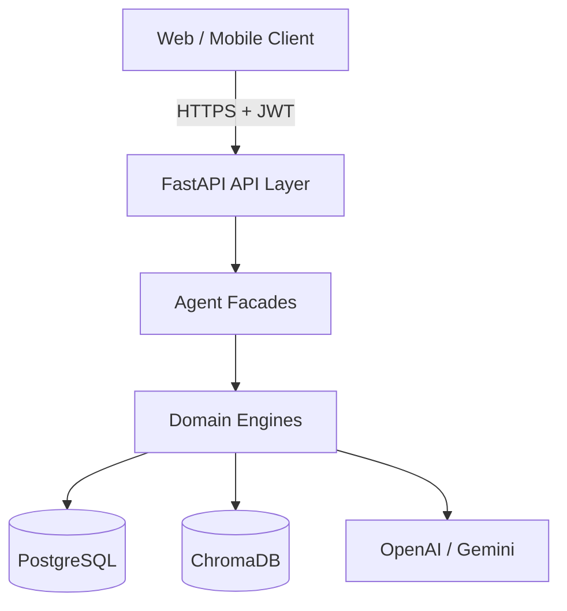
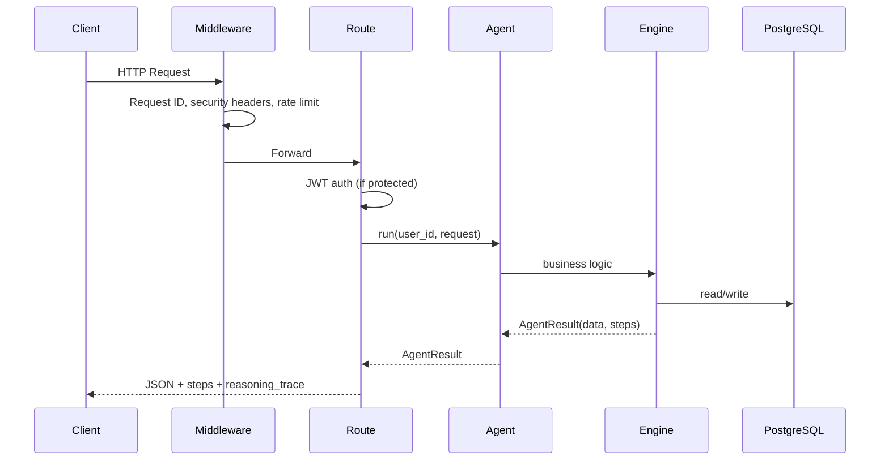

# MedisyncAI Backend — Architecture

**Version:** 1.0.0  
**Stack:** FastAPI · PostgreSQL · ChromaDB · OpenAI/Gemini

---

## System overview

MedisyncAI is a **behaviour-aware healthcare recommendation platform**. It ingests user profile data, behavioural memory, and cross-AI imported context to power multiple specialized agents (persona, recommendations, review simulation, risk detection) with **transparent reasoning traces**.



---

## Layered architecture

```
backend/
├── main.py                 # App factory, middleware, lifespan
├── app/
│   ├── api/
│   │   ├── routes/         # Thin HTTP controllers
│   │   ├── router.py       # Route registration
│   │   └── helpers.py      # AgentResult → response mapping
│   ├── agents/             # Agent facades (orchestration entry)
│   ├── analytics/          # Platform metrics engine
│   ├── persona/            # Persona generation engine
│   ├── recommendations/    # Recommendation engine
│   ├── review_simulation/  # Review simulation engine
│   ├── risk_detection/     # Risk detection engine
│   ├── memory/             # Behavioural memory + Chroma
│   ├── context_import/     # Cross-AI context extraction
│   ├── repositories/       # Data access (SQLAlchemy)
│   ├── models/             # ORM entities
│   ├── schemas/            # Pydantic request/response DTOs
│   ├── domain/             # Shared enums
│   ├── services/           # LLM, analytics, reasoning
│   └── core/               # Config, security, middleware, DI
├── alembic/                # Database migrations
├── tests/                  # Pytest suite
└── docs/                   # Module & production documentation
```

### Design principles

| Principle | Implementation |
|-----------|----------------|
| Thin controllers | Routes validate auth, call agent/engine, map response |
| Dependency injection | FastAPI `Depends()` factories in `core/deps.py` |
| Typed agent results | `AgentResult[T]` + `steps: list[str]` |
| Dual memory store | PostgreSQL (source of truth) + ChromaDB (vectors) |
| Fail fast in prod | `Settings.validate_runtime()` on startup |

---

## Request lifecycle



---

## Authentication & authorization

| Role | Mechanism |
|------|-----------|
| User | JWT Bearer token (`Authorization: Bearer <token>`) |
| Admin | Same JWT + `users.is_admin = true` |

```
POST /api/v1/auth/register  → 201 User
POST /api/v1/auth/login     → 200 { access_token }
GET  /api/v1/auth/me        → 200 User (protected)
```

Passwords hashed with **bcrypt**. Tokens signed with **HS256**.

---

## Core modules

### Behavioural Memory Engine

- **CRUD** on `memories` table
- **Semantic search** via ChromaDB cosine similarity
- **Summarize** memories with LLM
- Categories: `health`, `behaviour`, `recommendation`, `communication`

### Cross-AI Context Import

- Platform prompts (ChatGPT, Gemini, Claude)
- Extract structured health fields + confidence
- Persist to PostgreSQL + create memory entries

### Persona Engine

Inputs: profile, memory, imports  
Output: `persona_name`, `reasoning`, `confidence_score`

### Recommendation Engine

Inputs: profile, persona, memory, imports  
Categories: sleep, hydration, stress, health_apps, etc.

### Review Simulation Engine

Simulates persona-based product/service reviews (Task A).

### Risk Detection Engine

Detects symptom patterns, behavioural deterioration, recurring concerns.  
Levels: `low`, `moderate`, `high`.

### Analytics Module

Admin dashboards: KPIs + chart-ready time series (14-day windows).

### Reasoning Traces

Every agent response includes `steps[]`. Stored in `reasoning_traces` table.  
Query: `GET /api/v1/reasoning/traces`.

---

## Data model (summary)

| Table | Purpose |
|-------|---------|
| `users` | Accounts + admin flag |
| `user_profiles` | Demographics & health profile |
| `memories` | Behavioural memory entries |
| `context_imports` | Imported AI context |
| `personas` | Generated personas |
| `recommendations` | Generated recommendations |
| `review_simulations` | Simulated reviews |
| `risk_assessments` | Risk detection results |
| `reasoning_traces` | Agent reasoning steps |
| `analytics_events` | Event tracking |

---

## External integrations

| Service | Purpose | Config |
|---------|---------|--------|
| PostgreSQL | Primary datastore | `DATABASE_URL` |
| ChromaDB | Vector embeddings | `CHROMA_PERSIST_DIR` |
| OpenAI | LLM | `LLM_PROVIDER=openai` |
| Google Gemini | LLM | `LLM_PROVIDER=gemini` |
| Mock | Tests / demo | `LLM_PROVIDER=mock` |

---

## API surface

Prefix: `/api/v1`

| Group | Prefix | Auth |
|-------|--------|------|
| Auth | `/auth` | Public (register/login) |
| Profile | `/profile` | User |
| Context import | `/context-import` | User |
| Memory | `/memory` | User |
| Persona | `/persona` | User |
| Recommendations | `/recommendations` | User |
| Simulation | `/simulation` | User |
| Analysis | `/analysis` | User |
| Reasoning | `/reasoning` | User |
| Analytics | `/analytics` | **Admin** |
| Admin | `/admin` | **Admin** |

Health (no prefix): `GET /health`, `GET /health/ready`

Full reference: [API.md](API.md)

---

## Production middleware

| Middleware | Function |
|------------|----------|
| `RequestIdMiddleware` | `X-Request-ID` correlation |
| `SecurityHeadersMiddleware` | HSTS, nosniff, frame deny |
| `RateLimitMiddleware` | Per-IP rate limits |
| `CORSMiddleware` | Explicit origin allowlist |

---

## Configuration

Centralized in `app/core/config.py` via `pydantic-settings`.  
See `.env.example` and [DEPLOYMENT_CHECKLIST.md](DEPLOYMENT_CHECKLIST.md).

---

## Testing

```bash
cd backend
pytest -v
```

73+ tests covering auth, agents, memory, analytics, security middleware.

`tests/conftest.py` uses shared SQLite in-memory DB + Chroma mock.

---

## Related documentation

| Document | Topic |
|----------|-------|
| [SECURITY_REPORT.md](SECURITY_REPORT.md) | Security audit |
| [PERFORMANCE_REPORT.md](PERFORMANCE_REPORT.md) | Performance & scaling |
| [DEPLOYMENT_CHECKLIST.md](DEPLOYMENT_CHECKLIST.md) | Go-live checklist |
| [MEMORY_ENGINE.md](MEMORY_ENGINE.md) | Memory module |
| [PERSONA_ENGINE.md](PERSONA_ENGINE.md) | Persona module |
| [RECOMMENDATION_AGENT.md](RECOMMENDATION_AGENT.md) | Recommendations |
| [REVIEW_SIMULATION_AGENT.md](REVIEW_SIMULATION_AGENT.md) | Review simulation |
| [RISK_DETECTION_AGENT.md](RISK_DETECTION_AGENT.md) | Risk detection |
| [ANALYTICS_MODULE.md](ANALYTICS_MODULE.md) | Analytics |
| [REASONING_TRACES.md](REASONING_TRACES.md) | Reasoning traces |
| [AUDIT_REPORT.md](AUDIT_REPORT.md) | Initial architecture audit |

---

## Evolution roadmap

1. **Redis** — rate limits, caching, session revocation
2. **pgvector** — consolidate vectors into PostgreSQL
3. **Background jobs** — Celery/ARQ for long LLM tasks
4. **OpenTelemetry** — distributed tracing
5. **Refresh tokens** — shorter access token TTL
