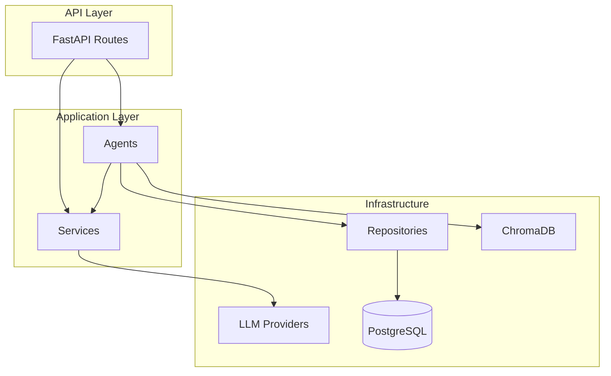

# MedisyncAI Backend — Architecture Audit Report

**Date:** 2026-05-24  
**Scope:** Full backend (`backend/app/`)  
**Status:** Refactored — all 4 tests passing

---

## Executive Summary

The backend was audited across structure, security, API design, duplication, naming, database design, and FastAPI practices. **18 issues** were identified; **14 were fixed** in this refactor. The codebase now follows a clearer clean-architecture layering with dependency injection, typed agent results, centralized error handling, and structured logging.

---

## 1. Issues Found

### 1.1 Folder Structure

| ID | Severity | Issue |
|----|----------|-------|
| S-01 | Medium | Missing `__init__.py` in most packages (`api/`, `agents/`, `services/`, etc.) — implicit namespace packages only |
| S-02 | Low | No dedicated `domain/` or `repositories/` layer — business logic mixed with routes and agents |
| S-03 | Low | Empty placeholder packages from initial scaffold (`auth/`, `recommendations/` as folders) were redundant with `api/routes/` |

### 1.2 Scalability

| ID | Severity | Issue |
|----|----------|-------|
| SC-01 | Medium | `LLMService` and `ChromaMemoryStore` instantiated per-request without interface abstraction |
| SC-02 | Medium | `get_session_factory()` recreated on every `get_db()` call (no caching) |
| SC-03 | Low | Chroma semantic search implemented but never exposed via API |
| SC-04 | Low | No connection pool tuning or read-replica separation |

### 1.3 Security

| ID | Severity | Issue |
|----|----------|-------|
| SEC-01 | **High** | `/api/v1/analytics/*` endpoints were **public** — exposed user counts and platform stats |
| SEC-02 | **High** | CORS `allow_origins=["*"]` with `allow_credentials=True` — invalid and unsafe |
| SEC-03 | Medium | Default `SECRET_KEY` and `admin_password` in code / `.env.example` |
| SEC-04 | Medium | JWT `exp` claim used `datetime` object instead of Unix timestamp |
| SEC-05 | Medium | `int(payload["sub"])` could raise uncaught `ValueError` → 500 |
| SEC-06 | Low | No runtime validation of LLM API keys when provider ≠ mock |
| SEC-07 | Low | No rate limiting on auth or agent endpoints |

### 1.4 API Design

| ID | Severity | Issue |
|----|----------|-------|
| API-01 | **High** | `response_model=PersonaGenerateResponse` but handler returned dict with `reasoning_trace` — **stripped by FastAPI** |
| API-02 | Medium | Agent routes returned untyped `dict` instead of composite schemas |
| API-03 | Medium | Admin routes returned `list[dict[str, Any]]` — weak OpenAPI contracts |
| API-04 | Low | Duplicate `/analytics/overview` and `/admin/analytics` with identical logic |
| API-05 | Low | `GET /context-import/prompt` intentionally public (acceptable for hackathon) |

### 1.5 Code Duplication

| ID | Severity | Issue |
|----|----------|-------|
| DUP-01 | Medium | Five route files repeated `{**response.model_dump(), "reasoning_trace": ...}` |
| DUP-02 | Medium | Four agents duplicated memory-load → LLM → trace pattern |
| DUP-03 | Low | `MemoryCategory` enum defined in both `models/memory.py` and `schemas/memory.py` |
| DUP-04 | Low | `ReasoningService.to_response()` and `wrap_steps()` never used |

### 1.6 Naming Conventions

| ID | Severity | Issue |
|----|----------|-------|
| N-01 | Low | `MemoryAgent.run()` returned generic `dict` — misleading name for unused search API |
| N-02 | Low | `recent_count_7d` in analytics actually returned total count |

### 1.7 Database Design

| ID | Severity | Issue |
|----|----------|-------|
| DB-01 | Medium | Seed script wrote memories to PostgreSQL **without** Chroma sync |
| DB-02 | Low | `Memory.category` stored as plain `str` while enum existed in model layer |
| DB-03 | Low | No DB-level check constraint on `risk_level` or `rating` ranges |
| DB-04 | Low | `analytics_events.event_data` as untyped JSON text |

### 1.8 FastAPI Best Practices

| ID | Severity | Issue |
|----|----------|-------|
| FP-01 | **High** | No global exception handlers — unhandled errors returned opaque 500s |
| FP-02 | Medium | No structured logging |
| FP-03 | Medium | Services used `@staticmethod` — not injectable/testable |
| FP-04 | Medium | Auto-commit in `get_db` for all requests including read-only GETs |
| FP-05 | Low | `HTTPBearer()` returned 403 instead of 401 when token missing |
| FP-06 | Low | No startup configuration validation |

---

## 2. Improvements Made

### 2.1 Clean Architecture Layers

```
app/
├── domain/           # Enums & domain types (MemoryCategory, RiskLevel)
├── repositories/     # Data access (User, Profile, Memory)
├── services/         # LLM, analytics, reasoning (injectable instances)
├── agents/           # Orchestration (typed AgentResult[T])
├── api/
│   ├── routes/       # Thin controllers
│   └── helpers.py    # Shared response mapping
├── core/             # Config, deps, security, logging, exceptions
└── memory/           # ChromaDB adapter
```

### 2.2 Dependency Injection (`app/core/deps.py`)

- Factory dependencies for all agents, repositories, and services
- `MemoryAgent` receives `ChromaMemoryStore`, `MemoryRepository`, `ProfileRepository` via constructor
- Routes depend on agents — not raw `AsyncSession` + manual instantiation

### 2.3 Security Hardening

| Fix | Detail |
|-----|--------|
| Analytics locked | All `/analytics/*` routes now require **admin** JWT |
| CORS | Configurable via `CORS_ORIGINS` env var; no wildcard + credentials |
| JWT | `exp` encoded as Unix timestamp (`int`) |
| Token parsing | Invalid `sub` → 401, not 500 |
| HTTPBearer | `auto_error=False` → consistent 401 with `WWW-Authenticate` |
| Startup validation | `Settings.validate_runtime()` checks secret key and LLM keys |

### 2.4 API Design

- Composite response models: `PersonaGenerateResult`, `RecommendationResult`, `ReviewSimulationResult`, `BehaviourAnalysisResult`, `RiskAnalysisResult` — all include `reasoning_trace`
- `to_agent_result_schema()` helper eliminates duplicated route merging
- Admin routes use typed `UserResponse`, `MemoryResponse`, `RecommendationHistoryItem`

### 2.5 Error Handling & Logging

- Custom exceptions: `NotFoundError`, `ConflictError`, `AuthenticationError`, `LLMServiceError`, etc.
- Global handlers in `app/core/exception_handlers.py` registered in `main.py`
- Structured logging via `app/core/logging.py` with configurable `LOG_LEVEL`
- LLM failures → 503 with logged stack traces
- Chroma delete failures logged as warnings (not silently swallowed)

### 2.6 Code Quality

- `AgentResult[T]` dataclass for typed agent outputs
- `BaseAgent.load_user_context()` shared across context-aware agents
- Single `MemoryCategory` enum in `app/domain/enums.py`
- `RiskLevel` enum with Pydantic validation on API responses
- `AnalyticsService.get_recommendation_analytics()` — fixed 7-day filter
- Seed script syncs memories to Chroma via `MemoryAgent`
- Removed dead `ReasoningService.wrap_steps()` usage pattern (consolidated into helper)
- Cached `get_session_factory()` with `@lru_cache`
- Replaced `passlib` with direct `bcrypt` (Python 3.13 compatibility)

### 2.7 Package Structure

- Added `__init__.py` to all major packages
- Added `domain/`, `repositories/`, `api/helpers.py`

---

## 3. Architectural Recommendations

### 3.1 Short Term (Hackathon / MVP)

1. **Add rate limiting** — `slowapi` or middleware on `/auth/login` and agent endpoints.
2. **Expand test coverage** — memory CRUD, persona, analytics auth, context import, admin routes.
3. **Expose semantic memory search** — `GET /memory/search?q=` using existing Chroma integration.
4. **Use ReviewSimulationAgent with stored persona** — optionally load latest `Persona` for the user instead of requiring `persona_name` in body.

### 3.2 Medium Term (Production)

1. **Repository interfaces** — abstract `UserRepository` behind a Protocol for unit tests without DB.
2. **Unit of Work pattern** — explicit transaction boundaries instead of auto-commit per request.
3. **Background tasks** — offload LLM calls to Celery/ARQ for long-running agent operations.
4. **Refresh tokens** — short-lived access tokens + refresh token rotation.
5. **Health check depth** — `/health` should verify PostgreSQL and Chroma connectivity.
6. **Observability** — OpenTelemetry traces across agent steps; correlate with `reasoning_traces` table.

### 3.3 Long Term (Scale)

1. **Event-driven architecture** — publish `recommendation_generated` to a message bus for analytics pipelines.
2. **Multi-tenancy** — organization/clinic scope on all queries if B2B deployment.
3. **Encryption at rest** — for `context_imports.raw_content` and health memories (field-level encryption).
4. **Read models** — materialized views or CQRS for analytics dashboards.
5. **LLM abstraction** — `LLMProvider` Protocol with circuit breaker and fallback chain (OpenAI → Gemini → mock).

### 3.4 Database

1. Add CHECK constraints: `rating BETWEEN 1 AND 5`, `confidence BETWEEN 0 AND 1`.
2. Index `recommendations.created_at` for analytics time-range queries.
3. Consider JSONB for `analytics_events.event_data` and `context_imports.extracted_data` on PostgreSQL.

### 3.5 Target Architecture Diagram



---

## 4. Files Changed (Summary)

| Area | Files |
|------|-------|
| New | `domain/`, `repositories/`, `core/logging.py`, `core/exceptions.py`, `core/exception_handlers.py`, `api/helpers.py` |
| Refactored | All `agents/*`, all `api/routes/*`, `services/*`, `core/deps.py`, `core/config.py`, `core/security.py`, `main.py`, `memory/chroma_store.py`, `scripts/seed.py` |
| Schemas | Added `*Result` models with `reasoning_trace`; unified enums |
| Docs | This report |

---

## 5. Verification

```bash
cd backend
$env:DATABASE_URL="sqlite+aiosqlite:///:memory:"
$env:LLM_PROVIDER="mock"
$env:DEBUG="true"
pytest -v
# 4 passed
```

---

*Report generated after architecture audit and refactor. For API usage see [API.md](API.md).*
