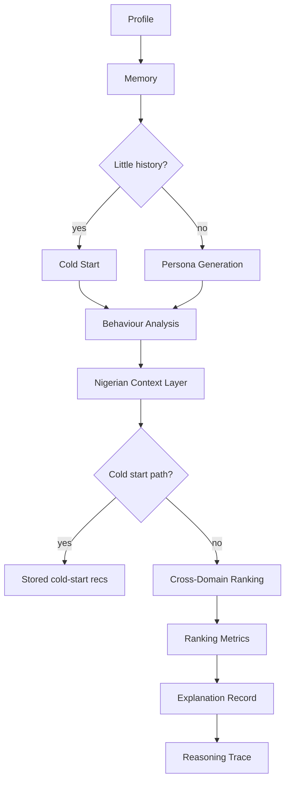

# DSN x Bluechip LLM Agent Challenge — Backend Features

MedisyncAI exposes all HTTP APIs under **`/api/v1`**. Browser clients must set **`CORS_ORIGINS`** on the backend to include the frontend origin (e.g. `http://127.0.0.1:5500`).

## Challenge agents

| Feature | Endpoint | Description |
|--------|----------|-------------|
| Cold Start Agent | `POST /api/v1/agents/cold-start` | Recommendations for users with little/no history from onboarding data |
| Cross-Domain Ranking | `POST /api/v1/agents/cross-domain/rank` | Rank across health_apps, wellness_products, educational_content, food_nutrition, exercise_plans, productivity_habits, telemedicine_services |
| Nigerian Context | `POST /api/v1/agents/nigerian-context` | Affordability, student budget, lifestyle, communication style |
| Orchestrator | `POST /api/v1/agents/orchestrate` | Full pipeline: profile → memory → persona → behaviour → Nigerian context → ranking → trace → explanation |
| Explanations | `GET /api/v1/explanations/{id}` | Reasoning, memory snapshot, persona, confidence |
| Evaluation Task A | `POST /api/v1/evaluation/task-a` | Rating accuracy, behavioural fidelity, review quality |
| Evaluation Task B | `POST /api/v1/evaluation/task-b` | NDCG@10, hit rate, diversity, contextual relevance |

## Orchestration flow



## Behaviour fidelity

Every `POST /api/v1/simulation/simulate` response includes a **`fidelity`** object:

```json
{
  "fidelity_score": 0.92,
  "evidence": [{"factor": "persona_voice", "score": 0.85, "note": "..."}]
}
```

Scores are persisted on `review_simulations.fidelity_score`.

## Ranking metrics

`app/evaluation/metrics.py` implements:

- **NDCG@10** — normalized discounted cumulative gain
- **Hit Rate** — fraction of items above confidence threshold
- **Recommendation Diversity** — category spread (Herfindahl + unique ratio)

Metrics are stored on each `recommendation_ranking_batches` row and returned in cross-domain rank responses.

## Database migration

Run on deploy:

```bash
alembic upgrade head
```

Migration `010_challenge_agents` adds: `cold_start_runs`, `nigerian_context_records`, `recommendation_ranking_batches`, `explanations`, `evaluation_reports`, `orchestration_runs`, and fidelity columns on `review_simulations`.

## Environment

| Variable | Purpose |
|----------|---------|
| `API_PREFIX` | Default `/api/v1` |
| `CORS_ORIGINS` | Comma-separated allowed browser origins |
| `LLM_PROVIDER` | `mock` for local/tests; `openai` or `gemini` in production |
